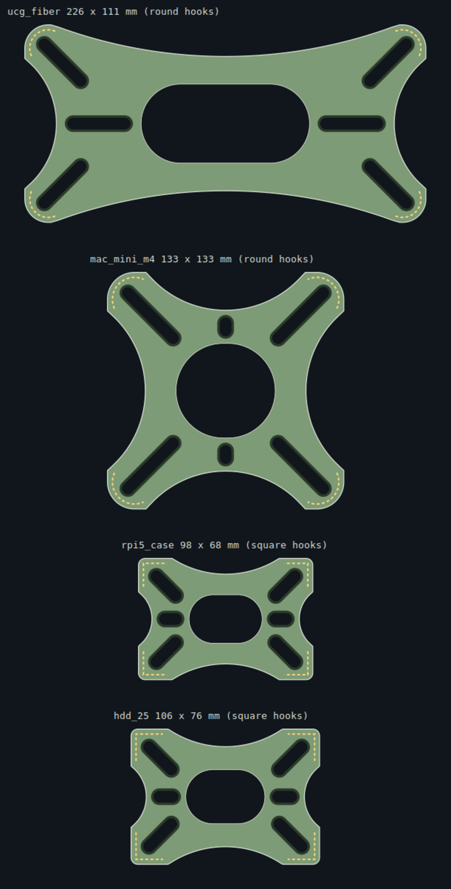

# Enclosure Bracket Generator

A Fusion 360 Add-In that generates a parametric device-mounting bracket for
structured media enclosures (Legrand On-Q, Leviton, and similar). Select a
preset device, adjust parameters in the built-in dialog, and the add-in builds
a complete bracket as a **native Fusion timeline** — real sketches, real
features, real user parameters. Not a mesh or a dumb imported body.

Designed for FDM printing and sized for wall-mounted enclosures (worst-case
load).



---

## Installation

1. Download or clone this repository.
2. In Fusion 360: **Utilities → ADD-INS → Scripts and Add-Ins → Add-Ins tab → ⊕**
3. Navigate to and select the **`EnclosureBracket`** folder (the one that
   contains `EnclosureBracket.py` and `EnclosureBracket.manifest`).
4. Click **Run**. Optionally check **Run on Startup** so it loads automatically.
5. The command appears in **SOLID → CREATE → Enclosure Bracket**.

---

## Usage

1. Open a new, empty Fusion 360 design (parametric mode).
2. Click **Enclosure Bracket** in the CREATE menu.
3. Choose a preset device or select **Custom device** and enter your own
   measurements.
4. Adjust plate and hook parameters as needed.
5. Click **OK** — the bracket generates in its own component.

> **Measure your device with calipers.** The preset dimensions are
> estimates. A press-fit bracket is only as good as the numbers you feed it.
> Always verify fit against the real device before printing.

After generation, all key dimensions are live Fusion parameters under
**Modify → Change Parameters**. Edit them and the model rebuilds.

---

## Device presets

| Preset | Device | Hook style |
|---|---|---|
| UniFi Cloud Gateway Fiber | UCG Fiber | Round |
| Mac mini (M4, 2024) | Mac mini M4 | Round |
| Mac mini (M1/M2, 2020–2023) | Mac mini M1/M2 | Round |
| Raspberry Pi 5 – official case | Pi 5 in case | Square |
| Raspberry Pi bare board (4B/5) | Bare Pi PCB | Square |
| 3.5 inch hard drive | 3.5″ HDD | Square |
| 2.5 inch hard drive / SSD (9.5 mm) | 2.5″ HDD/SSD | Square |
| Custom device | — | Square |

---

## Hook styles

The choice of hook style depends on the device's corner geometry.

### Round hooks
A circular arc that wraps the device's corner. Works well for devices with
genuinely rounded corners (UCG Fiber, Mac mini). The arc is capped at 90° per
corner so the device can always be removed.

The inner radius of the hook equals the device corner radius plus the fit
clearance. Physics limits how much larger the hook can be before the device's
own corner collides with the hook wall — roughly 3.4× the fit clearance (about
1.4 mm at 0.4 mm clearance). On near-square corners this becomes a useless stub,
which is why square hooks exist.

**Corner support blocks** (controlled by *Corner support* in the dialog, default
4 mm) add a small rectangular pad at the two endpoints of each hook arc to
reinforce the junction with the plate surface.

### Square hooks
L-shaped walls with straight legs running down each face of the device. Reliable
on near-square corners (Raspberry Pi, hard drives, most cases). The leg length
controls how far the hook extends from the corner toward the centre of each edge.

Hooks are built oversize and trimmed to the plate outline, so the outer corners
of square hooks automatically pick up the plate's corner radius.

---

## Dialog parameters

### Device dimensions

| Field | Description |
|---|---|
| Width (X) | Device width |
| Depth (Y) | Device depth |
| Height (Z) | Device height (determines hook wall height) |
| Corner radius | Outer corner radius of the device |
| Hook style | Round or Square (see above) |
| Hook leg length | *Square only* — how far each L-arm extends from the corner |

### Plate & hooks

| Field | Description |
|---|---|
| Plate thickness | Overall thickness of the mounting plate (default 5 mm) |
| Fit clearance | Per-side gap between device and hook inner face (default 0.4 mm) |
| Hook wall thickness | Wall thickness of the hook arms (default 2.8 mm = 7 perimeters at 0.4 mm) |
| Retaining lip depth | Inward overhang that locks the device in (default 1.2 mm) |
| Lip height | Height of the lip ramp (default 1.6 mm) |
| Hook base fillet | Fillet radius at the junction between hook and plate (0 = off) |
| Base chamfer | Chamfer on the bottom face to relieve elephant's foot (0 = off) |
| Corner support | *Round hooks only* — support block width at arc endpoints (0 = off) |

### Features

| Field | Description |
|---|---|
| Center opening | Oval cutout in the middle of the plate to save material |
| Corner plunger slots | Diagonal slots at the corners for plunger fasteners |
| Side plunger slots | Slots on the long or short centreline |
| Ventilation holes | Hex-pattern circular vents across the plate face |

---

## Plunger fasteners

The bracket uses custom two-piece push-and-twist fasteners instead of
conventional screws. The slot dimensions in the add-in are sized for:

- Shaft diameter: 6.5 mm (slot width: 6.6 mm)
- Lip diameter: 8.8 mm (pocket width: 9.4 mm)
- Material under lip: 3.0 mm

These match the enclosure mounting hole geometry. The slots are as long as
the available material allows — the add-in scans the actual plate region and
finds the longest unobstructed run, so you get maximum adjustment range
without breaking the plate outline or fouling a hook wall.

---

## Slot placement

Rather than a heuristic, the add-in **scans the actual plate region** — the
rounded rectangle minus the waist scallops, minus the central opening, minus the
hook footprints — and finds the longest contiguous run along each slot's axis that
has room for the full 9.4 mm lip pocket plus an edge margin.

Corner slots sit at the **outboard** end of the usable run so they land on the
corner pad rather than drifting toward the middle. They are held clear of the
hook walls' footing, since a pocket under a wall would leave it standing on a
3 mm ledge.

Side slots try the X centreline first and fall back to Y when the X run is too
short (configurable — auto / x / y / both).

Slot positions and lengths appear as live Fusion parameters after generation
(`slot_corner_x`, `slot_corner_y`, `slot_corner_len`, `slot_side_x_len`, etc.).

---

## Waist (hourglass outline)

The plate outline is scalloped on all four edges to reduce material and give the
bracket a cleaner look. The scallop depth is scaled to `min(plate_length,
plate_width)` so it stays proportional on elongated plates. On very
small or extreme-aspect-ratio devices the scallop is omitted if there is no room.

---

## FDM printing

| Setting | Recommendation |
|---|---|
| Orientation | Flat on plate, hooks pointing up. No support needed at defaults. |
| Material | PETG or ASA. Media enclosures get warm; PLA creeps under sustained load at elevated temperature. |
| Wall count | Default `hook_t` = 2.8 mm = 7 perimeters at 0.4 mm nozzle, essentially solid regardless of infill. |
| Lip overhang | The retaining lip uses a tapered extrude — the underside is a ramp, not a flat overhang. Keep `hook_lip ≤ hook_lip_h` and the ramp stays at or below 45°, no support needed. |
| Insertion | Hooks flex apart as you push the device past the lip (snap-fit). If it feels too stiff, reduce `hook_lip`. If the device rattles, reduce `hook_h_adj`. |

---

## Live parameters (after generation)

Once generated, these drive the model directly without re-running the add-in:

| Parameter | Description |
|---|---|
| `dev_w`, `dev_d`, `dev_h`, `dev_corner_r` | Device dimensions |
| `fit_clear` | Per-side fit clearance |
| `plate_t`, `hook_t`, `hook_h` | Plate and hook sizing |
| `hook_lip`, `hook_lip_h` | Retaining lip |
| `corner_r`, `hook_ir` | Corner and hook radii |
| `waist_d_x`, `waist_d_y` | Waist scallop depths |
| `center_l`, `center_w` | Central opening |
| `slot_corner_len`, `slot_side_*_len` | Slot lengths |
| `slot_corner_x/y`, `slot_side_*_pos` | Slot positions |
| `hook_fillet`, `base_chamfer` | Finishing features |
| `hook_support_w` | Corner support block width |

Hook style, slot count, vent layout, and slot angles require re-running the
add-in because they change the number or orientation of sketch entities.

---

## Geometry verification

`verify.py` (at the repo root) stubs out the Fusion API so the module can be
imported, then independently re-derives the geometry and checks it against
hand-written predicates:

- Every slot pocket stays inside the plate outline with margin
- No slot pocket undercuts a hook wall's footing
- No two slot pockets collide with each other
- Waist scallops blend tangentially into the corner arcs and cut exactly the
  depth requested
- Round hook arcs stay within 90° per corner so the device can always be removed
- Corner support blocks have the correct dimensions and land at the device
  clearance boundary
- ~400 randomised device sizes (45–260 × 40–220 mm, both hook styles) all pass

Run it after any geometry change:

```
python verify.py
```

---

## Repo structure

```
EnclosureBracket/
  EnclosureBracket.py          Add-In entry point (run / stop)
  EnclosureBracket.manifest    Fusion add-in manifest
  commands/
    generateBracket/
      entry.py                 Dialog, event handlers, presets
      build.py                 Fusion API build logic (Builder, build())
  lib/
    geometry.py                Pure-Python geometry helpers (no Fusion dependency)
verify.py                      Standalone geometry test harness
previews/                      SVG top-view previews per preset
README.md                      This file
```
